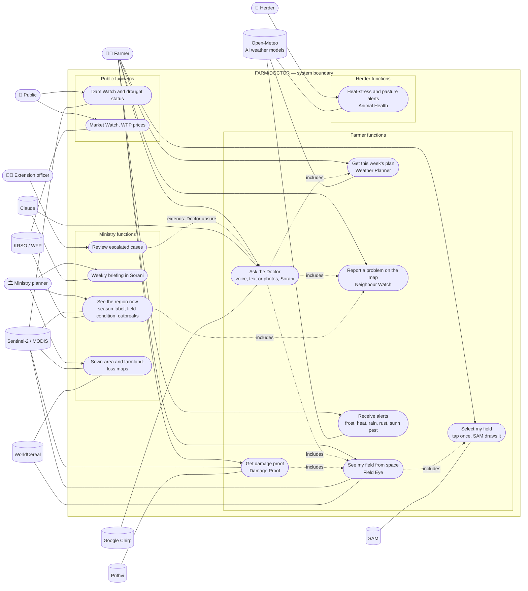

# Farm Doctor: use case diagram (2026-10-08)

## Actors
- **Farmer** (mobile app)
- **Herder** (mobile app)
- **Ministry planner** (web map)
- **Extension / plant-protection officer** (web map; receives escalations)
- **Public** (web map, no login)
- External systems: **Sentinel-2** (ESA), **Open-Meteo** (ECMWF/GraphCast forecasts), **Claude**, **Google Chirp** (Sorani speech), **SAM**, **Prithvi**, **WorldCereal**, **KRSO/WFP data**

## Diagram

## Scope boundary

**Inside the system**
- The 5 core AIs: Field Eye, Weather Planner, Plant Doctor, Season Check, Neighbour Watch.
- The add-ons: Dam Watch, Damage Proof, Farmland Loss, Animal Health, Market Watch, Sown Map.
- The Doctor layer (Claude, Sorani): combines the AIs' numbers into advice, shows which input drove it, refuses doses, escalates when unsure.
- Farmer mobile app, Ministry web map, public web page.
- Case log for measuring accuracy.

**Outside the system (used, not built)**
- Satellites and their data (ESA, NASA), weather models (ECMWF, Google), Claude, Chirp, SAM, Prithvi, WorldCereal, KRSO and WFP statistics.
- Extension officers and vets: the system hands cases to them; it does not replace them.

**Explicitly out of scope**
- Long-range forecasts (season, El Niño, climate).
- Pesticide or fertilizer doses.
- Yield in tonnes per field; soil fertility maps; price forecasts; credit, insurance, fraud detection; food-safety checks from photos.
- Any hardware (sensors, drones).

## Main functions, one line each
| # | Function | Input | Output |
|---|---|---|---|
| UC1 | Select my field | one tap on the map | field boundary (SAM) |
| UC2 | See my field from space | field boundary | satellite picture, greenness vs own normal and vs neighbours, weak patches, since when |
| UC3 | This week's plan | village, crop, growth stage, 10-day forecast | sow / urea / spray / harvest timing, frost and heat warnings |
| UC4 | Ask the Doctor | voice, text, 3–6 photos | likely cause, confidence, what to do now, what it cannot tell, referral |
| UC5 | Report a problem | pin + photo + type | pin on the outbreak map; nearby similar reports |
| UC6 | Damage proof | field + event date | before/after pictures, damaged %, claim letter |
| UC7 | Alerts | push notifications | frost, heat, heavy rain, rust weather, sunn-pest window |
| UC8 | Herder alerts | village | heat-stress index, pasture greenness vs normal |
| UC9 | Region now | — | Kurdistan → area → zone: season label, condition, outbreaks, dams |
| UC10 | Weekly briefing | region data | one-page Sorani/English brief |
| UC11 | Escalations | Doctor "unsure" cases | queue for officers, with all inputs |
| UC12 | Sown area and farmland loss | season / 25 years | maps per district |
| UC13 | Dam Watch | — | Dukan, Darbandikhan area and % of full, drought status |
| UC14 | Market Watch | WFP prices | this month vs last, unusual jumps |
